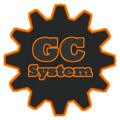

===========================================
Bienvenue dans la documentation du GCsystem
===========================================

Présentation rapide
===================

Le GCsystem est un framework PHP MVC full stack orienté objet. Son apparition remonte à l'été 2011. A l'époque, il s'agissait seulement d'une organisation plus claire des codes sources ainsi que de l'existence de quelques fonctions constituant une sorte de librairie. Un an plus tard, le système a été entièrement recodé pour sa version 2.0, ne gardant comme point commun que le système de rubrique déjà existant et en introduisant le modèle MVC (Modèle Vue Contrôleur). 

La version actuelle (3.0) cherche cette fois à professionnaliser le framework en lui apportant les composants qui lui manquaient (Orm, gestion des erreurs, Composer etc.) et en lui donnant une structure plus robuste et plus facilement maintenable.

Philosophie du GCsystem
=======================

Le premier but du GCsystem est d'être simple à comprendre d'un premier abord pour permettre d'aller rapidement au plus important : créer votre application web. Pour cela, le GCsystem est basé sur le principe des modules : une rubrique constitue un ensemble de fonctionnalités relativement proche. Par exemple, on trouvera généralement deux ou trois modules sur un site : 

- Front office
- Back office
- REST api

De plus, le GCsystem est également - comme la plupart des framework aujourd'hui - d'un grande assistance pour tout ce qui concerne les tâches rébarbatives telles que : l'authentification, les droits d'accès, le routing, la gestion du cache, la sécurité etc.  
Le GCsystem inclue également quelques helpers aujourd'hui bien développés qui permettent de simplifier grandement des mécanismes tels que les formulaires, l'envoi de mail ou encore la pagination.
En clair, le GCsystem se veut être un outil simple mais puissant qui sera à même de répondre à tous vos besoin.

Aperçu
======

.. sourcecode:: php

    <?php
    namespace Gcs;

    use System\Controller\Controller;
    use System\Template\Template;
    use Orm\Entity\Article;
    use Orm\Entity\Category;

    class Article extends Controller{
        public function actionNew(){
            return (new Template('index/formPost', 'formDefault'))
                ->assign('title', 'Création article')
                ->assign('category', Category::find()->fetch())
                ->show();
        }

        public function actionSave(Article $article){
            if($article->valid()){
                $article->save();
            }
            else{
                return (new Template('index/formPost', 'formDefault'))
                    ->assign('title', 'Création article')
                    ->assign('article', $article)
                    ->assign('category', Category::find()->fetch())
                    ->show();
            }
        }
    }

Équipe de développement
=======================

Le GCsystem est activement développé par fabsgc et lucas5190

Sommaire
========

.. toctree::
    :maxdepth: 4

    getting-started/index
    advanced/index
    tutorial/index
    helper/index
    other/index